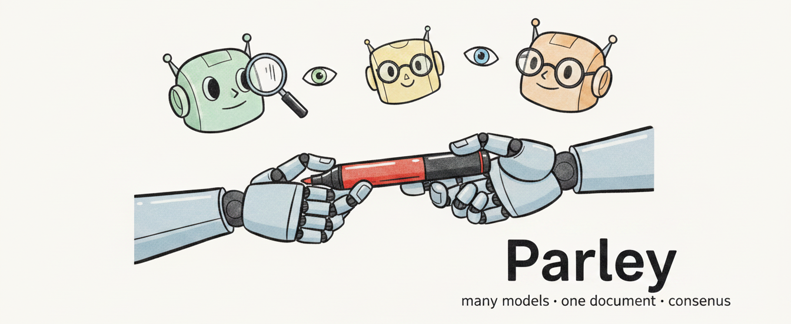
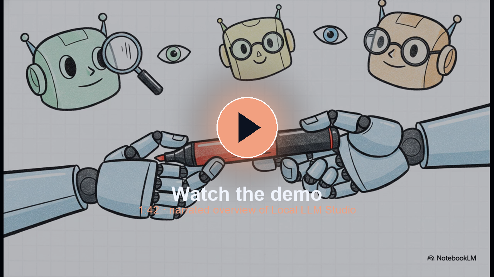
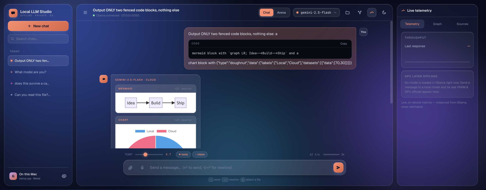
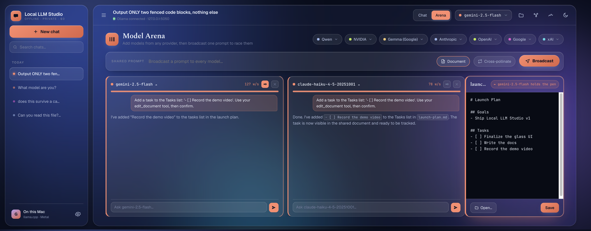
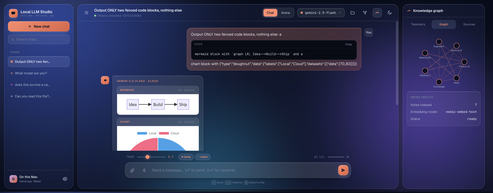
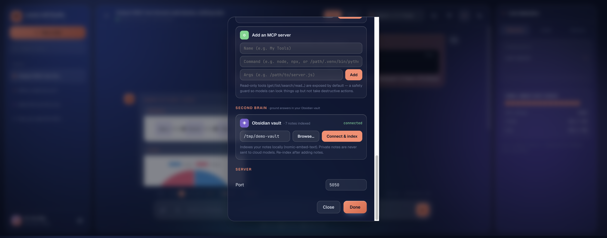

<div align="center">

# Parley

### Put several AI models in one room — race them on a prompt, then watch them critique each other and collaborate on a single document until they reach consensus.

Add the models you trust — Claude, GPT, Gemini, Grok, or local models through [Ollama](https://ollama.com/) — and put them to work *together*: **race** them on the same prompt, **cross‑pollinate** their answers, then hand them a document and let them **critique each other and co‑write it**, passing a single pen by consensus. A glassy workspace where many minds reach one answer — and nothing leaves your computer unless you say so.



[](https://www.python.org/)
[](https://flask.palletsprojects.com/)
[](https://ollama.com/)
[](#-portable-app)


### 🎬 Watch the demo

<a href="https://github.com/Panic-In-The-Distro/parley/raw/main/docs/demo/local-llm-studio-notebooklm-brief.mp4"></a>

<sub>▶️ A 1:42 narrated overview (click to play) · or the [quick screenshot tour](docs/demo/local-llm-studio-demo.mp4)</sub>

</div>

---

## Why it exists

Most AI apps send your conversations — and your context — to someone else's server. Parley flips that: it runs models **on your hardware** through [Ollama](https://ollama.com/), keeps your chats and notes on disk, and only touches the cloud when *you* connect a key. It's a single, polished interface for everything from a quick offline chat to a multi‑model "boardroom" working on the same document.

## ✨ Highlights

- **🏟 Model Arena** — add models from any provider and broadcast one prompt to all of them at once, each in its own scrollable chat card with live tokens/sec. Then **cross‑pollinate**: share every answer with the others and have each model reconsider.
- **✒️ One document, many minds** — open a file in the Arena and hand the *pen* to a model. Every model can **read** the document; the pen‑holder can **edit** it with a tool call — and the change appears live for everyone. Pass the pen and watch a different model take over.
- **🧠 Your second brain** — point it at your Obsidian vault and answers get grounded in *your* notes (local embeddings, never sent to the cloud). A **knowledge graph** maps how your notes connect.
- **🔌 Local + cloud, one picker** — Qwen, Gemma, Llama, NVIDIA Nemotron locally; Claude, GPT, Gemini, and Grok in the cloud. Not installed? It downloads on first use, with a progress bar.
- **📊 Live artifacts** — models can draw **Mermaid** diagrams, **Chart.js** charts, **SVG**, and sandboxed **HTML** that render right in the chat.
- **🛠 Bring your own tools** — connect any **MCP server** in Settings and its tools become available to every model (read‑only by default, for safety).
- **🔒 Private by design** — offline models cost **$0** and never phone home; a structural guard keeps your private notes out of any prompt that goes to a cloud model.



---

## 🏟 Several models, one shared document

Give one model the **pen** and broadcast a prompt — it edits the open document with a tool call while every other model reads along. The edit lands live in the panel; hand the pen to another model and it picks up where the last left off.



## 🧠 A second brain that actually connects

Connect your Obsidian vault in Settings and Parley indexes it locally with `nomic-embed-text`. Relevant notes are pulled into every answer automatically, and the **knowledge graph** shows the web of links between them — the real structure of how you think.



## 🔌 Connect models, tools, and your vault — all in one place

Bring keys for any cloud provider, connect MCP servers whose tools reach every model, and point the second brain at your vault — no config files to edit.



---

## 🚀 Quick start (from source)

> Requires [Ollama](https://ollama.com/) running locally and Python 3.11.

```bash
git clone https://github.com/Panic-In-The-Distro/parley.git
cd parley
python3 -m venv .venv && source .venv/bin/activate
pip install -r requirements.txt

ollama pull gemma4:12b-it-qat      # a capable local default
ollama pull nomic-embed-text       # for the second brain

python supervisor.py               # opens the UI at http://127.0.0.1:5050
```

Then, optionally:
- **Cloud models** — Settings → Cloud models → paste a provider key.
- **Second brain** — Settings → Second brain → *Browse…* to your Obsidian vault → *Connect & index*.
- **MCP tools** — Settings → Tools (MCP) → add a server (copy `mcp_servers.example.json` → `mcp_servers.json`).

## 📦 Portable app

For a zero‑prerequisite build (no Python, no separate Ollama install — the engine is bundled and models download on first run), see **[PACKAGING.md](PACKAGING.md)**. A GitHub Actions workflow builds **macOS (Apple Silicon + Intel)** and **Windows** installers; macOS builds are code‑signed + notarized when signing secrets are present.

---

## 🏗 How it works

```
 Browser UI  ──►  supervisor.py ──►  app.py (Flask worker)  ──►  Ollama  (local models)
 (glass SPA)      (control plane)    proxy · RAG · tools         cloud provider APIs
                                          │
                                          ├─ second brain  (local vector index of your vault)
                                          ├─ MCP bridge    (your tools, read‑safe by default)
                                          └─ artifacts      (mermaid / chart / svg / html)
```

- **Backend** — a Flask app proxying to a local Ollama server, with second‑brain retrieval, an MCP tool bridge, and the shared‑document engine.
- **Frontend** — a single glassy SPA (vanilla JS + CSS, no framework), light/dark themes, accent presets.
- **Private** — chats, models, and config live on your machine; cloud keys stay in a gitignored local config and are never committed.

## 🔐 A note on privacy

Local models are fully offline and free. When you connect a cloud key, only the messages you send to *that* model leave your machine — and your vault's `private/` notes are **structurally excluded** from any cloud‑bound prompt, so personal information can't leak even by accident.

---

<div align="center">
<sub>Built for people who want the power of many models without giving up their privacy.</sub>
</div>
